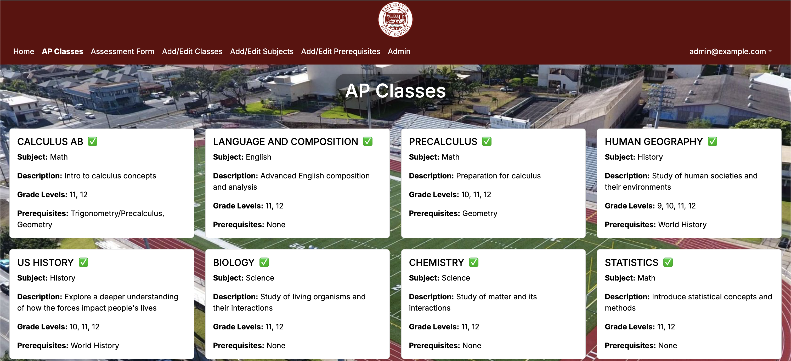

For my final project in ICS 314, my group and I developed a website that displayed what AP classes were available at Farrington High School, allowing students to recieve recommendations for what AP classes they should take based on an AI analysis of their responses to a questionnaire, teachers to be easily contacted by students, and AP coordinators and administrators to edit the different classes, subjects, and prerequisites to be shown to students. My personal contributions to this website were mainly focused around the classes page and the add subjects page, both seen down below.

With regards to the classes page, I created and set up the routing between the main classes page and each of the pages for the individual classes. I also set up the class data in the database to be seeded and displayed by the cards for each individual class and wrote the code for the database actions. For the add/edit subjects page, I created the base for the frontend, including displaying the already present classes from the database and the add subjects component of the page, and set up the backend functionality, editing the database based upon the inputs from the user and displaying those changes in realtime on the frontend. I also wrote Playwright tests to test the functionality of all the features of the add/edit subjects page to ensure all elements appeared properly and all database changes were present.

While working on this experience, I learned a lot about how to deal with challenges that I wasn't completely familiar with, as often the issues I took on were some that diverged from the knowledge I previously had, forcing me to conduct research on my own of how to solve these problems. I also gained valuable experience working on team projects, as I had never previously had to collaborate with others to work on a singular software entity before. Working on this project of course also helped improve my webpage development skills, as I got more comfortable using the frameworks utilized in this project. Overall, working on this project provided me with useful skills and practice that helped me grow as a software developer.

To see the full project page or to try it yourself, click <a href="https://farringtonap.github.io/farrington-ap.github.io/">here</a>.
